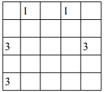
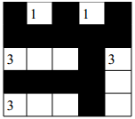

## Zadanie 11

`11. Zaimplementować algorytm oparty na metodzie powrotów rozwiązujący problem Nurikabe: (dla zadanej przez użytkownika planszy – samo jej ustalenie już nie jest trywialne).
Mamy siatkę z kwadratowymi polami (komórkami). Niektóre z tych komórek zawierają cyfry. Naszym celem jest ustalenie, które z komórek siatki są białe, a które czarne (Używając nazewnictwa Wyspy na Jeziorze: zamiast białego i czarnego pola odpowiednio mamy "wodę" i "ląd").
Czarne pola uformują "nurikabe" ("Jezioro"). Czarne pola muszą tworzyć jedną figurę - formę ciągłą (jedna figura składająca się z komórek), czarne pola nie zawierają cyfr, a także nie mogą tworzyć kwadratów 2x2 lub większych prostokątów.
Białe pola uformują "Wyspy": Każda cyfra n musi być częścią n-elementowego pola złożonego z białych komórek. Każda z białych komórek należy tylko do jednej wyspy; każda wyspa może posiadać tylko jedną komórkę z cyfrą.`

`Przykład: dla szachownicy 5x5`

`rozwiązaniem jest`

`5 pkt, termin 10.12`
